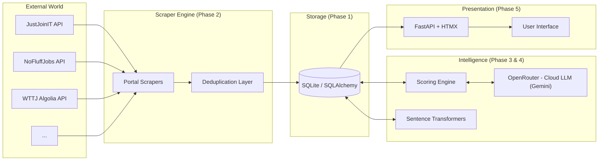
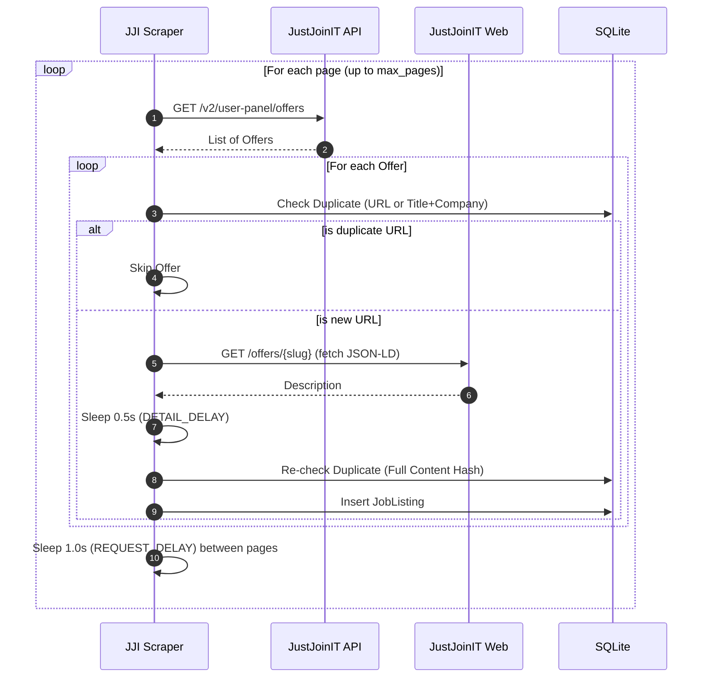
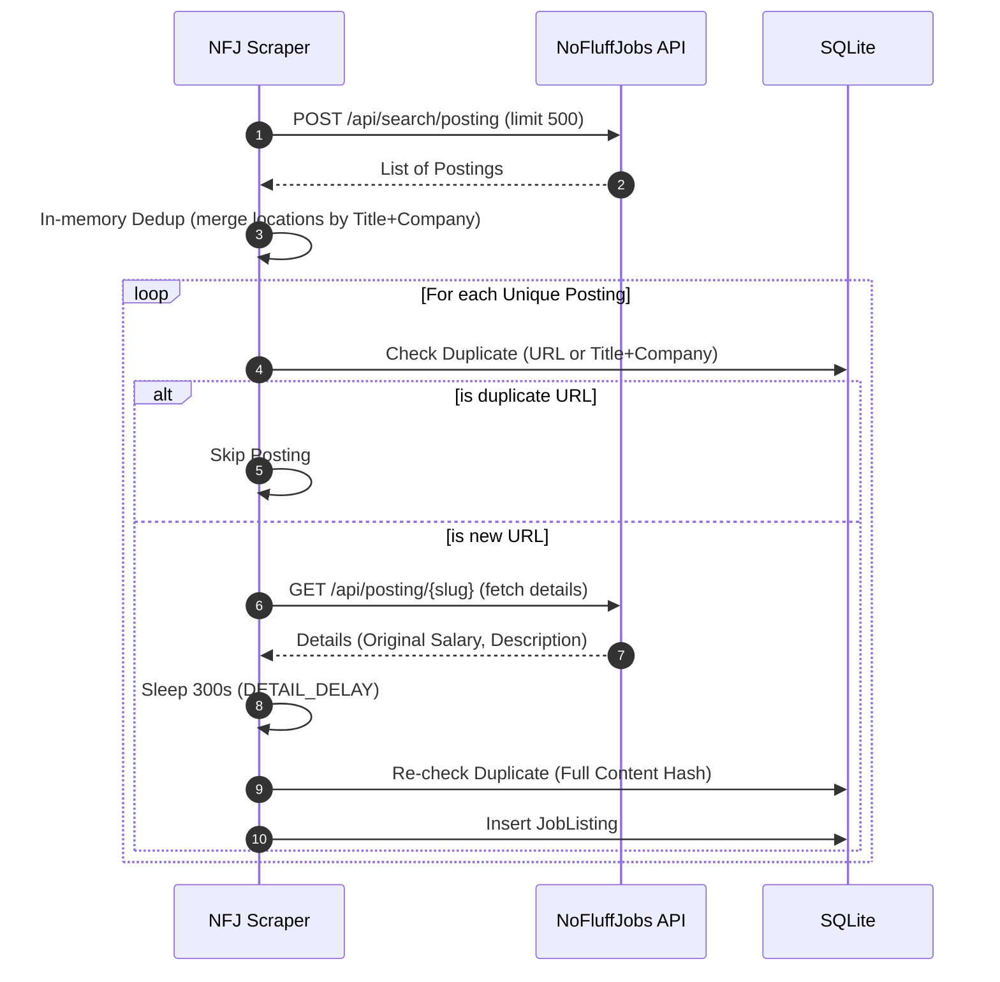
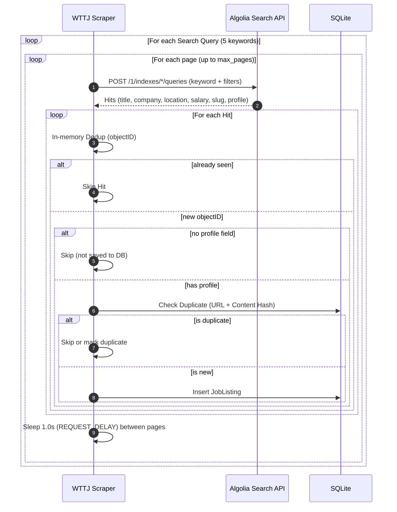
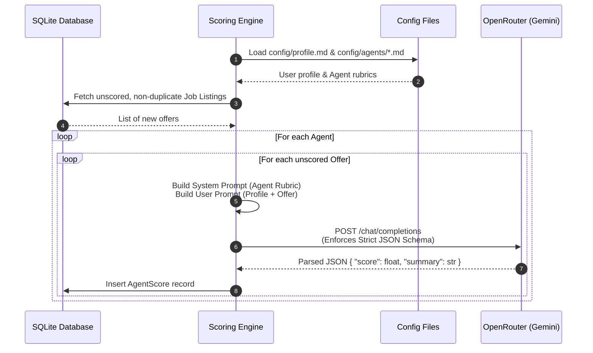

# Career Scout AI — Architecture

> System design, project structure, database schema, workflows, and architectural decisions.

---

## Table of Contents

1. [Tech Stack](#tech-stack)
2. [Target Project Structure](#target-project-structure)
3. [System Architecture](#system-architecture)
4. [Database Schema](#database-schema)
5. [Scraper Workflows](#scraper-workflows)
6. [Scoring Workflow](#scoring-workflow)
7. [Architecture Decision Records (ADRs)](#architecture-decision-records-adrs)

---

## Tech Stack

| Component | Technology | Notes |
|-----------|-----------|-------|
| Language | Python 3.12 | — |
| Packaging | `uv` + `pyproject.toml` + hatchling | — |
| HTTP | `httpx` | Lightweight, async-ready |
| Scraping (JS) | `playwright` | For JS-rendered portals (future: Otta) |
| Database | SQLite + SQLAlchemy 2.0 | Zero config; PostgreSQL migration possible |
| Migrations | Alembic | — |
| Config | `pydantic-settings` + `.env` | — |
| Cloud LLM (Primary) | Gemini 2.5 Flash (via OpenRouter) | Scoring, summaries — strict JSON format, fast & highly cost-effective |
| Local LLM (Archived) | Ollama (`qwen2.5:3b`) | Scoring, summaries — archived in codebase for future offline use |
| Scheduler | APScheduler | Scraping and report schedules |
| Web UI | FastAPI + Jinja2 + HTMX + TailwindCSS | — |
| Charts | Plotly / Chart.js | Trend visualization |
| Linting | Ruff, mypy, pre-commit | — |
| Testing | pytest, pytest-httpx | — |

---

## Target Project Structure

```
career-scout-ai/
├── pyproject.toml
├── .env
├── config/
│   ├── profile.md             # User profile: education, experience, aspirations
│   └── agents/                # Agent definitions (e.g., best_recommendations.md)
├── data/
├── src/career_scout_ai/
│   ├── config.py
│   ├── main.py
│   ├── scraper/
│   │   ├── base.py             # AbstractPortalScraper
│   │   ├── stealth.py          # User-Agent pool, fingerprint
│   │   ├── rate_limiter.py     # Token bucket + jitter
│   │   ├── humanizer.py        # Random delays, human-like behavior
│   │   ├── robots_checker.py
│   │   └── portals/
│   │       ├── justjoinit.py
│   │       ├── nofluffjobs.py
│   │       ├── bulldogjob.py
│   │       ├── welcometothejungle.py
│   │       ├── apec.py
│   │       ├── lesjeudis.py
│   │       ├── welovedevs.py
│   │       └── chooseyourboss.py
│   ├── storage/
│   │   ├── models.py           # JobListing, ScrapingRun, AgentScore
│   │   ├── database.py
│   │   ├── dedup.py
│   │   └── migrations/
│   ├── llm/
│   │   ├── ollama_client.py    # Local Ollama connection (archived)
│   │   └── openrouter_client.py # Cloud OpenRouter client (Gemini)
│   ├── scoring/
│   │   ├── engine.py           # Scoring orchestration
│   │   └── prompts.py          # Profile + agent + offer templates
│   └── web/
│       ├── app.py
│       ├── routes/
│       ├── templates/
│       └── static/
└── tests/
```

---

## System Architecture



---

## Database Schema

The system uses SQLite with SQLAlchemy 2.0 ORM. The schema is designed to track scraping execution, store unique job listings, and record agent-based scores.

### `JobListing`
Immutable core record of a job offer. Uniqueness is enforced via a 2-layer deduplication process (URL + content hash).

<table style="border-collapse: collapse; border: 1px solid #888; width: 800px; table-layout: fixed; text-align: left;">
  <thead>
    <tr>
      <th style="border: 1px solid #888; padding: 8px; width: 20%;">Column</th>
      <th style="border: 1px solid #888; padding: 8px; width: 20%;">Type</th>
      <th style="border: 1px solid #888; padding: 8px; width: 60%;">Description</th>
    </tr>
  </thead>
  <tbody>
    <tr>
      <td style="border: 1px solid #888; padding: 8px;"><code>id</code></td>
      <td style="border: 1px solid #888; padding: 8px;">Integer</td>
      <td style="border: 1px solid #888; padding: 8px;">Primary key</td>
    </tr>
    <tr>
      <td style="border: 1px solid #888; padding: 8px;"><code>url</code></td>
      <td style="border: 1px solid #888; padding: 8px;">String</td>
      <td style="border: 1px solid #888; padding: 8px;">Original URL of the job offer</td>
    </tr>
    <tr>
      <td style="border: 1px solid #888; padding: 8px;"><code>title</code></td>
      <td style="border: 1px solid #888; padding: 8px;">String</td>
      <td style="border: 1px solid #888; padding: 8px;">Job title</td>
    </tr>
    <tr>
      <td style="border: 1px solid #888; padding: 8px;"><code>company</code></td>
      <td style="border: 1px solid #888; padding: 8px;">String</td>
      <td style="border: 1px solid #888; padding: 8px;">Company name</td>
    </tr>
    <tr>
      <td style="border: 1px solid #888; padding: 8px;"><code>content_hash</code></td>
      <td style="border: 1px solid #888; padding: 8px;">String</td>
      <td style="border: 1px solid #888; padding: 8px;">SHA256 hash of (title + company + description)</td>
    </tr>
    <tr>
      <td style="border: 1px solid #888; padding: 8px;"><code>is_duplicate</code></td>
      <td style="border: 1px solid #888; padding: 8px;">Boolean</td>
      <td style="border: 1px solid #888; padding: 8px;">Flag indicating fuzzy cross-portal match (saves alternate versions)</td>
    </tr>
    <tr>
      <td style="border: 1px solid #888; padding: 8px;"><code>created_at</code></td>
      <td style="border: 1px solid #888; padding: 8px;">DateTime</td>
      <td style="border: 1px solid #888; padding: 8px;">Timestamp of offer ingestion</td>
    </tr>
  </tbody>
</table>

### `ScrapingRun`
Tracks metadata about individual scraping executions.

<table style="border-collapse: collapse; border: 1px solid #888; width: 800px; table-layout: fixed; text-align: left;">
  <thead>
    <tr>
      <th style="border: 1px solid #888; padding: 8px; width: 20%;">Column</th>
      <th style="border: 1px solid #888; padding: 8px; width: 20%;">Type</th>
      <th style="border: 1px solid #888; padding: 8px; width: 60%;">Description</th>
    </tr>
  </thead>
  <tbody>
    <tr>
      <td style="border: 1px solid #888; padding: 8px;"><code>id</code></td>
      <td style="border: 1px solid #888; padding: 8px;">Integer</td>
      <td style="border: 1px solid #888; padding: 8px;">Primary key</td>
    </tr>
    <tr>
      <td style="border: 1px solid #888; padding: 8px;"><code>start_time</code></td>
      <td style="border: 1px solid #888; padding: 8px;">DateTime</td>
      <td style="border: 1px solid #888; padding: 8px;">Execution start timestamp</td>
    </tr>
    <tr>
      <td style="border: 1px solid #888; padding: 8px;"><code>end_time</code></td>
      <td style="border: 1px solid #888; padding: 8px;">DateTime</td>
      <td style="border: 1px solid #888; padding: 8px;">Execution completion timestamp</td>
    </tr>
    <tr>
      <td style="border: 1px solid #888; padding: 8px;"><code>status</code></td>
      <td style="border: 1px solid #888; padding: 8px;">String</td>
      <td style="border: 1px solid #888; padding: 8px;">Status of the scraping execution</td>
    </tr>
  </tbody>
</table>

### `AgentScore`
Stores the LLM's evaluation of a `JobListing`. Enforces a unique constraint on `(job_listing_id, agent_name)` to ensure one score per agent persona.

<table style="border-collapse: collapse; border: 1px solid #888; width: 800px; table-layout: fixed; text-align: left;">
  <thead>
    <tr>
      <th style="border: 1px solid #888; padding: 8px; width: 20%;">Column</th>
      <th style="border: 1px solid #888; padding: 8px; width: 20%;">Type</th>
      <th style="border: 1px solid #888; padding: 8px; width: 60%;">Description</th>
    </tr>
  </thead>
  <tbody>
    <tr>
      <td style="border: 1px solid #888; padding: 8px;"><code>id</code></td>
      <td style="border: 1px solid #888; padding: 8px;">Integer</td>
      <td style="border: 1px solid #888; padding: 8px;">Primary key</td>
    </tr>
    <tr>
      <td style="border: 1px solid #888; padding: 8px;"><code>job_listing_id</code></td>
      <td style="border: 1px solid #888; padding: 8px;">Integer</td>
      <td style="border: 1px solid #888; padding: 8px;">Foreign key referencing the <code>JobListing</code></td>
    </tr>
    <tr>
      <td style="border: 1px solid #888; padding: 8px;"><code>agent_name</code></td>
      <td style="border: 1px solid #888; padding: 8px;">String</td>
      <td style="border: 1px solid #888; padding: 8px;">Name of the scoring persona (e.g., "ml-researcher")</td>
    </tr>
    <tr>
      <td style="border: 1px solid #888; padding: 8px;"><code>score</code></td>
      <td style="border: 1px solid #888; padding: 8px;">Float</td>
      <td style="border: 1px solid #888; padding: 8px;">Evaluation score ranging from 0.0 to 1.0</td>
    </tr>
    <tr>
      <td style="border: 1px solid #888; padding: 8px;"><code>summary</code></td>
      <td style="border: 1px solid #888; padding: 8px;">Text</td>
      <td style="border: 1px solid #888; padding: 8px;">LLM-generated reasoning for the score</td>
    </tr>
    <tr>
      <td style="border: 1px solid #888; padding: 8px;"><code>model_version</code></td>
      <td style="border: 1px solid #888; padding: 8px;">String</td>
      <td style="border: 1px solid #888; padding: 8px;">LLM version used during evaluation</td>
    </tr>
    <tr>
      <td style="border: 1px solid #888; padding: 8px;"><code>scored_at</code></td>
      <td style="border: 1px solid #888; padding: 8px;">DateTime</td>
      <td style="border: 1px solid #888; padding: 8px;">Timestamp of the scoring action</td>
    </tr>
  </tbody>
</table>

---

## Scraper Workflows

### JustJoinIT Scraper

The JustJoinIT scraper iterates through paginated API results, performs preliminary deduplication checks, fetches description details from the web (via JSON-LD), and implements specific rate limiting delays.



### NoFluffJobs Scraper

The NoFluffJobs scraper fetches a large batch in one request, groups multi-location duplicates in memory to save API calls, and then conservatively fetches job details with a massive 300-second delay per job to respect rate limits.



### Welcome to the Jungle Scraper

The WTTJ scraper queries the Algolia Search API for discovery and uses the `profile` field from Algolia responses as the job description. No detail page fetching is needed. Offers without a `profile` field in Algolia are skipped. Multiple search queries are executed to cover ML/DS/AI roles, with in-memory deduplication by Algolia `objectID` across queries.



---

## Scoring Workflow

The scoring phase evaluates freshly scraped offers against the user's career profile using persona-based agents.



---

## Architecture Decision Records (ADRs)

| # | Date | Decision | Rationale |
|---|------|----------|-----------|
| 1 | 2026-04 | **SQLite** as database | Zero config, sufficient for ~200 listings/day. PostgreSQL migration possible via SQLAlchemy. |
| 2 | 2026-04 | **2-layer dedup** (URL + content hash) instead of planned 3 layers | Fuzzy matching only makes sense with multiple portals. Layers 1-2 suffice for MVP. |
| 3 | 2026-04 | **Content hash** = SHA256(title + company + description), not location | Description better identifies uniqueness. Multilocation offers have identical description but different locations. |
| 4 | 2026-05 | **JJI description** from JSON-LD (schema.org JobPosting) | Simpler than DOM parsing. Stable format. |
| 5 | 2026-05 | **NFJ salaryCurrency/salaryPeriod** = PLN/month | Doesn't filter — only converts displayed amount. Without them API returns 0 results. |
| 6 | 2026-05 | **NFJ detail delay** = 300s (~12 req/h) | Conservative limit. `robots.txt` disallows `/api/`. Safety > speed. |
| 7 | 2026-05 | **NFJ multilocation dedup** before detail fetch | Group by (title, company). Without this: 3× more detail requests = 3× longer. |
| 8 | 2026-05 | **Sequential** scraper execution (not parallel) | Single IP, code simplicity. Scheduler (APScheduler) in Phase 6. |
| 9 | 2026-06 | **Ollama via HTTP API** (localhost) for LLM access | Easier to manage than loading models directly via `transformers`. Handles model lifecycle and quantization. |
| 10 | 2026-06 | **Agent extensibility** via `.md` files in `config/agents/` | Adding a new scoring agent only requires adding a markdown file. No code changes or DB migrations needed for new personas. |
| 11 | 2026-06 | **UniqueConstraint** on `(job_listing_id, agent_name)` | Ensures an offer is only scored once per agent. Prevents duplicate calls and ensures idempotent scoring runs. |
| 12 | 2026-06 | **Scoring only NEW offers** | Efficiency: ~30-50 min for ~200 new offers daily. Scoring already stored offers is unnecessary. |
| 13 | 2026-06 | **Oracle Cloud ARM (24GB RAM)** for deployment | Qwen3-8B requires ~6GB. Oracle's free tier is the only one sufficient for local LLM execution. |
| 14 | 2026-07 | **Migration to Cloud LLM (Gemini-2.5-flash via OpenRouter)** | Cloud-based Gemini-2.5-flash offers superior intelligence, strict JSON schema compliance, and response healing at negligible pay-as-you-go costs ($0.075 / 1M tokens), while eliminating local GPU/RAM hardware requirements. |
| 15 | 2026-07 | **Preserve Ollama client as archived fallback** | Retains local offline option (`ollama_client.py`) in the codebase for potential future local-only execution. |
| 16 | 2026-07 | **Consolidated setup and guide** | Replaced multiple OS-specific script variants with a single parameterizable `setup.sh` and a unified `docs/setup-guide.md` to simplify maintenance and VM/local developer onboarding. |
| 17 | 2026-07 | **Web UI: Vanilla JS + FastAPI** instead of HTMX/TailwindCSS framework | Minimal dependencies, full control over styling and interactions. Cyberpunk theme provides distinctive brand identity and improved visual hierarchy for job matching data. No build step required. |
| 18 | 2026-07 | **WTTJ via Algolia** instead of Playwright SPA scraping | WTTJ exposes Algolia App ID + public API key via `/api/env`. Querying Algolia directly returns structured JSON — no headless browser needed. Dramatically reduces implementation effort, maintenance, and breakage risk. |
| 19 | 2026-07 | **WTTJ descriptions from Algolia `profile` field**, not detail page JSON-LD | Algolia's `profile` field contains the same content as the detail page's JSON-LD description. Fetching detail pages triggers AWS WAF bot detection (202 challenge responses), making it unreliable. Using `profile` directly eliminates WAF issues, reduces scraping time from 5+ minutes to ~27 seconds, and removes the need for a second HTTP client. Offers without a `profile` field (~35%) are skipped. |

---

## Related Documents

- [project-plan.md](project-plan.md) — vision, implementation plan, and current status
- [setup-guide.md](setup-guide.md) — instructions on setting up, running, troubleshooting, and scheduling the pipeline
- [legal.md](legal.md) — scraping legal analysis per portal
