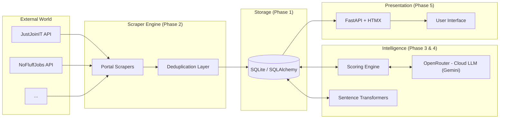
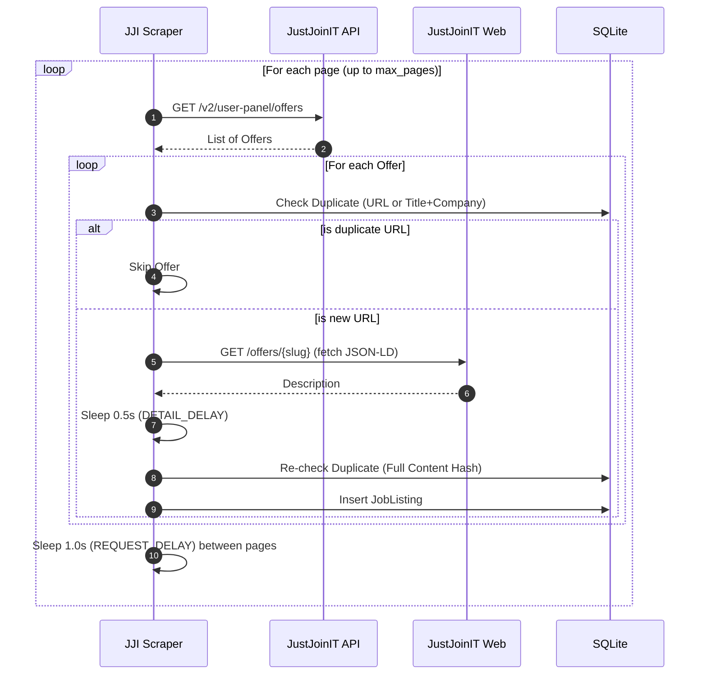
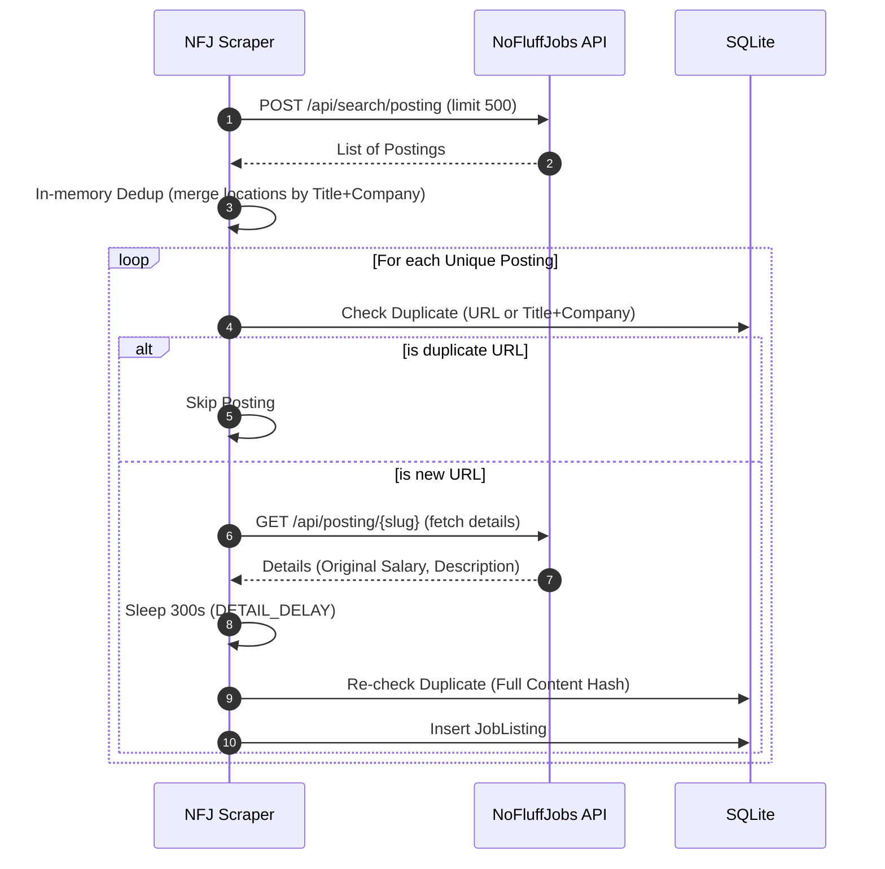
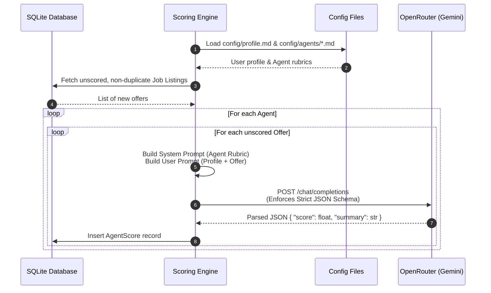

# Career Scout AI — Project Plan

> Consolidated document: vision, implementation plan, current status, and key architecture decisions.

---

## Table of Contents

1. [Project Vision](#project-vision)
2. [Tech Stack](#tech-stack)
3. [System Architecture](#system-architecture)
4. [Target Project Structure](#target-project-structure)
5. [Implementation Plan](#implementation-plan)
   - [Phase 1: Foundation ✅](#phase-1-foundation-)
   - [Phase 2: Scraper Engine](#phase-2-scraper-engine)
   - [Phase 3: Advanced Deduplication](#phase-3-advanced-deduplication)
   - [Phase 4: LLM Scoring & Reports](#phase-4-llm-scoring--reports)
    - [Phase 5: Web UI 🔧](#phase-5-web-ui-)
   - [Phase 6: Automation & Deployment](#phase-6-automation--deployment)
5. [Implementation Status](#implementation-status)
   - [Done ✅](#done-)
   - [In Progress 🔧](#in-progress-)
   - [Planned 📋](#planned-)
6. [Architecture Decision Records (ADRs)](#architecture-decision-records-adrs)
7. [Related Documents](#related-documents)

---

## Project Vision

A Python application that scrapes IT job listings from PL+FR portals in the background, deduplicates (hashing + fuzzy matching), stores in SQLite, then filters/scores them with a cloud LLM (Gemini via OpenRouter) against the user's profile and agent-defined criteria. Outputs ranked HTML reports. UI via FastAPI + TailwindCSS + HTMX. Runs locally on Mac; optional migration to Oracle Cloud Free Tier.

**Cost:** Minimal pay-as-you-go API costs (typically <$1/month utilizing Gemini 2.5 Flash via OpenRouter; local Ollama client archived for potential future $0 cost offline runs).

---

## Tech Stack

| Component | Technology | Notes |
|-----------|-----------|-------|
| Language | Python 3.12 | — |
| Packaging | `uv` + `pyproject.toml` + hatchling | — |
| HTTP | `httpx` | Lightweight, async-ready |
| Scraping (JS) | `playwright` | For JS-rendered portals (e.g. WTTJ) |
| Database | SQLite + SQLAlchemy 2.0 | Zero config; PostgreSQL migration possible |
| Migrations | Alembic | — |
| Config | `pydantic-settings` + `.env` | — |
| Cloud LLM (Primary) | Gemini 2.5 Flash (via OpenRouter) | Scoring, summaries — strict JSON format, fast & highly cost-effective |
| Local LLM (Archived) | Ollama (`qwen2.5:3b`) | Scoring, summaries — archived in codebase for future offline use |
| Scheduler | APScheduler | Scraping and report schedules |
| Web UI | FastAPI + Jinja2 + HTMX + TailwindCSS | — |
| Charts | Plotly / Chart.js | Trend visualization |
| Linting | Ruff, mypy, pre-commit | — |
| Testing | pytest, pytest-httpx | — |

---

## System Architecture



### Database Schema

The system uses SQLite with SQLAlchemy 2.0 ORM. The schema is designed to track scraping execution, store unique job listings, and record agent-based scores.

#### `JobListing`
Immutable core record of a job offer. Uniqueness is enforced via a 2-layer deduplication process (URL + content hash).

<table style="border-collapse: collapse; border: 1px solid #888; width: 800px; table-layout: fixed; text-align: left;">
  <thead>
    <tr>
      <th style="border: 1px solid #888; padding: 8px; width: 20%;">Column</th>
      <th style="border: 1px solid #888; padding: 8px; width: 20%;">Type</th>
      <th style="border: 1px solid #888; padding: 8px; width: 60%;">Description</th>
    </tr>
  </thead>
  <tbody>
    <tr>
      <td style="border: 1px solid #888; padding: 8px;"><code>id</code></td>
      <td style="border: 1px solid #888; padding: 8px;">Integer</td>
      <td style="border: 1px solid #888; padding: 8px;">Primary key</td>
    </tr>
    <tr>
      <td style="border: 1px solid #888; padding: 8px;"><code>url</code></td>
      <td style="border: 1px solid #888; padding: 8px;">String</td>
      <td style="border: 1px solid #888; padding: 8px;">Original URL of the job offer</td>
    </tr>
    <tr>
      <td style="border: 1px solid #888; padding: 8px;"><code>title</code></td>
      <td style="border: 1px solid #888; padding: 8px;">String</td>
      <td style="border: 1px solid #888; padding: 8px;">Job title</td>
    </tr>
    <tr>
      <td style="border: 1px solid #888; padding: 8px;"><code>company</code></td>
      <td style="border: 1px solid #888; padding: 8px;">String</td>
      <td style="border: 1px solid #888; padding: 8px;">Company name</td>
    </tr>
    <tr>
      <td style="border: 1px solid #888; padding: 8px;"><code>content_hash</code></td>
      <td style="border: 1px solid #888; padding: 8px;">String</td>
      <td style="border: 1px solid #888; padding: 8px;">SHA256 hash of (title + company + description)</td>
    </tr>
    <tr>
      <td style="border: 1px solid #888; padding: 8px;"><code>is_duplicate</code></td>
      <td style="border: 1px solid #888; padding: 8px;">Boolean</td>
      <td style="border: 1px solid #888; padding: 8px;">Flag indicating fuzzy cross-portal match (saves alternate versions)</td>
    </tr>
    <tr>
      <td style="border: 1px solid #888; padding: 8px;"><code>created_at</code></td>
      <td style="border: 1px solid #888; padding: 8px;">DateTime</td>
      <td style="border: 1px solid #888; padding: 8px;">Timestamp of offer ingestion</td>
    </tr>
  </tbody>
</table>

#### `ScrapingRun`
Tracks metadata about individual scraping executions.

<table style="border-collapse: collapse; border: 1px solid #888; width: 800px; table-layout: fixed; text-align: left;">
  <thead>
    <tr>
      <th style="border: 1px solid #888; padding: 8px; width: 20%;">Column</th>
      <th style="border: 1px solid #888; padding: 8px; width: 20%;">Type</th>
      <th style="border: 1px solid #888; padding: 8px; width: 60%;">Description</th>
    </tr>
  </thead>
  <tbody>
    <tr>
      <td style="border: 1px solid #888; padding: 8px;"><code>id</code></td>
      <td style="border: 1px solid #888; padding: 8px;">Integer</td>
      <td style="border: 1px solid #888; padding: 8px;">Primary key</td>
    </tr>
    <tr>
      <td style="border: 1px solid #888; padding: 8px;"><code>start_time</code></td>
      <td style="border: 1px solid #888; padding: 8px;">DateTime</td>
      <td style="border: 1px solid #888; padding: 8px;">Execution start timestamp</td>
    </tr>
    <tr>
      <td style="border: 1px solid #888; padding: 8px;"><code>end_time</code></td>
      <td style="border: 1px solid #888; padding: 8px;">DateTime</td>
      <td style="border: 1px solid #888; padding: 8px;">Execution completion timestamp</td>
    </tr>
    <tr>
      <td style="border: 1px solid #888; padding: 8px;"><code>status</code></td>
      <td style="border: 1px solid #888; padding: 8px;">String</td>
      <td style="border: 1px solid #888; padding: 8px;">Status of the scraping execution</td>
    </tr>
  </tbody>
</table>

#### `AgentScore`
Stores the LLM's evaluation of a `JobListing`. Enforces a unique constraint on `(job_listing_id, agent_name)` to ensure one score per agent persona.

<table style="border-collapse: collapse; border: 1px solid #888; width: 800px; table-layout: fixed; text-align: left;">
  <thead>
    <tr>
      <th style="border: 1px solid #888; padding: 8px; width: 20%;">Column</th>
      <th style="border: 1px solid #888; padding: 8px; width: 20%;">Type</th>
      <th style="border: 1px solid #888; padding: 8px; width: 60%;">Description</th>
    </tr>
  </thead>
  <tbody>
    <tr>
      <td style="border: 1px solid #888; padding: 8px;"><code>id</code></td>
      <td style="border: 1px solid #888; padding: 8px;">Integer</td>
      <td style="border: 1px solid #888; padding: 8px;">Primary key</td>
    </tr>
    <tr>
      <td style="border: 1px solid #888; padding: 8px;"><code>job_listing_id</code></td>
      <td style="border: 1px solid #888; padding: 8px;">Integer</td>
      <td style="border: 1px solid #888; padding: 8px;">Foreign key referencing the <code>JobListing</code></td>
    </tr>
    <tr>
      <td style="border: 1px solid #888; padding: 8px;"><code>agent_name</code></td>
      <td style="border: 1px solid #888; padding: 8px;">String</td>
      <td style="border: 1px solid #888; padding: 8px;">Name of the scoring persona (e.g., "ml-researcher")</td>
    </tr>
    <tr>
      <td style="border: 1px solid #888; padding: 8px;"><code>score</code></td>
      <td style="border: 1px solid #888; padding: 8px;">Float</td>
      <td style="border: 1px solid #888; padding: 8px;">Evaluation score ranging from 0.0 to 1.0</td>
    </tr>
    <tr>
      <td style="border: 1px solid #888; padding: 8px;"><code>summary</code></td>
      <td style="border: 1px solid #888; padding: 8px;">Text</td>
      <td style="border: 1px solid #888; padding: 8px;">LLM-generated reasoning for the score</td>
    </tr>
    <tr>
      <td style="border: 1px solid #888; padding: 8px;"><code>model_version</code></td>
      <td style="border: 1px solid #888; padding: 8px;">String</td>
      <td style="border: 1px solid #888; padding: 8px;">LLM version used during evaluation</td>
    </tr>
    <tr>
      <td style="border: 1px solid #888; padding: 8px;"><code>scored_at</code></td>
      <td style="border: 1px solid #888; padding: 8px;">DateTime</td>
      <td style="border: 1px solid #888; padding: 8px;">Timestamp of the scoring action</td>
    </tr>
  </tbody>
</table>

### Scraper Workflows

#### JustJoinIT Scraper

The JustJoinIT scraper iterates through paginated API results, performs preliminary deduplication checks, fetches description details from the web (via JSON-LD), and implements specific rate limiting delays.



#### NoFluffJobs Scraper

The NoFluffJobs scraper fetches a large batch in one request, groups multi-location duplicates in memory to save API calls, and then conservatively fetches job details with a massive 300-second delay per job to respect rate limits.



### Scoring Workflow

The scoring phase evaluates freshly scraped offers against the user's career profile using persona-based agents.



---

## Target Project Structure

```
career-scout-ai/
├── pyproject.toml
├── .env
├── config/
│   ├── profile.md             # User profile: education, experience, aspirations
│   └── agents/                # Agent definitions (e.g., best_recommendations.md)
├── data/
├── src/career_scout_ai/
│   ├── config.py
│   ├── main.py
│   ├── scraper/
│   │   ├── base.py             # AbstractPortalScraper
│   │   ├── stealth.py          # User-Agent pool, fingerprint
│   │   ├── rate_limiter.py     # Token bucket + jitter
│   │   ├── humanizer.py        # Random delays, human-like behavior
│   │   ├── robots_checker.py
│   │   └── portals/
│   │       ├── justjoinit.py
│   │       ├── nofluffjobs.py
│   │       ├── bulldogjob.py
│   │       ├── welcometothejungle.py
│   │       ├── apec.py
│   │       ├── lesjeudis.py
│   │       ├── welovedevs.py
│   │       └── chooseyourboss.py
│   ├── storage/
│   │   ├── models.py           # JobListing, ScrapingRun, AgentScore
│   │   ├── database.py
│   │   ├── dedup.py
│   │   └── migrations/
│   ├── llm/
│   │   ├── ollama_client.py    # Local Ollama connection (archived)
│   │   └── openrouter_client.py # Cloud OpenRouter client (Gemini)
│   ├── scoring/
│   │   ├── engine.py           # Scoring orchestration
│   │   └── prompts.py          # Profile + agent + offer templates
│   └── web/
│       ├── app.py
│       ├── routes/
│       ├── templates/
│       └── static/
└── tests/
```

---

## Implementation Plan

### Phase 1: Foundation ✅

#### Plan

1. Project init (`pyproject.toml`, `uv`, hatchling, pre-commit)
2. Pydantic Settings (`config.py`) + `.env`
3. SQLAlchemy models: `JobListing` (immutable), `ScrapingRun`
4. SQLite engine + session factory + Alembic migrations
5. 2-layer deduplication: URL + content hash (`dedup.py`)

### Phase 2: Scraper Engine

#### Plan

1. Implement scrapers per portal (priority order):
   - **JustJoinIT** — public API v2, pagination, JSON-LD description
   - **NoFluffJobs** — internal search API + detail endpoint, multilocation dedup
   - **Bulldogjob** — HTML scraping
   - **Welcome to the Jungle** — Playwright (SPA)
   - **FR portals:** APEC, LesJeudis, WeLoveDevs, ChooseYourBoss
2. Stealth middleware: User-Agent pool, fingerprint masking, random delays
3. Rate limiter: token bucket + jitter (8-25s base, micro/macro pauses)
4. Robots checker: parse and respect `robots.txt`
5. Entry point `main.py` — sequential scraper execution

#### Notes

- Portals scraped sequentially (single IP → staggered, not parallel). Random order each cycle.
- NFJ requires portal-specific multilocation dedup: grouping by (title, company) and merging cities before detail fetch to avoid redundant 5-min-delayed requests.
- Stealth middleware, rate limiter, and robots checker are NOT needed for JJI (public API) or NFJ (ultra-conservative 300s delay is sufficient). They become necessary when adding HTML-scraped portals (Bulldogjob, WTTJ, FR portals) which have bot detection and higher request volumes.

### Phase 3: Advanced Deduplication

#### Plan

1. Fuzzy cross-portal dedup (`rapidfuzz`, threshold 85%)
2. Flag `is_duplicate=true` for cross-portal matches (save, don't skip)
3. Optional: `sentence-transformers` embeddings + cosine similarity (layer 4)

#### Notes

- Current basic dedup (URL + content hash) is unlikely to catch cross-portal duplicates — URLs differ between portals, and descriptions/company names typically have formatting differences that break exact hash matching. Theoretically possible if content is byte-identical, but rare in practice.
- Fuzzy matching compares (company, title) of new offers against existing records. Unlike layers 1-2 which SKIP duplicates, fuzzy matches are SAVED with `is_duplicate=true` — cross-portal duplicates may contain different salary/description data worth keeping.
- Becomes valuable once ≥2 portals scrape overlapping offers (already possible with JJI + NFJ, but real value comes with more portals).

### Phase 4: LLM Scoring & Reports ✅

#### Plan

1. User profile file (`config/profile.md`) — education, experience, projects, aspirations
2. Create `AgentScore` SQLAlchemy model + Alembic migration:
   - `job_listing_id` (FK → JobListing)
   - `agent_name` (e.g., "ml-researcher", "ai-engineering")
   - `score` (Float, 0-1)
   - `summary` (Text — why this offer is relevant)
   - `scored_at`, `model_version`
   - Unique constraint on (job_listing_id, agent_name)
3. Agent definitions as .md files in `config/agents/` — describes what kind of offers to select. Scoring prompt combines profile + agent instructions + offer → score (0-1) + summary.
4. OpenRouter/Gemini API client + retry/backoff logic + response formatting + response healing

#### Notes

- Migrated to Cloud LLM (`google/gemini-2.5-flash` via OpenRouter). The pipeline utilizes OpenRouter's strict JSON schema mode and response-healing features to ensure robust scoring results.
- ~200 offers/day processed very rapidly compared to local execution (sub-second or low-second response times).
- Extremely low cost: Gemini-2.5-flash is highly cost-efficient, keeping monthly costs negligible.
- Ollama client kept as an archived fallback in the codebase for potential fully-offline or self-hosted deployment.
- No separate CV parser needed — profile is a plain .md file read directly.
- Multi-agent design: adding a new agent = new .md instruction file in `config/agents/` + scoring run. No migration needed.
- Re-scoring one agent (e.g., after prompt change) doesn't affect other agents' results.
- Best models (open) for this task:

| Model | Context Window | Deployment / VRAM | Main Use Case | Architectural Advantage |
| :--- | :--- | :--- | :--- | :--- |
| **Qwen3-32B** | 131K | Locally (1x GPU 24GB) / API | Feature extraction and stable JSON output | High information density, SOTA instruction-following |
| **Qwen3-8B** | 32K | Locally (Oracle A1 24GB) | Daily scoring and summaries | High quality vs footprint, fits in Oracle Free Tier |
| **DeepSeek V4-Flash** | 1M | Cheap API ($0.27/1M) | Mass screening and fast filtering | Architecture oriented towards agentic throughput, no *Lost-in-the-Middle* |
| **DeepSeek-R1** | 128K | API / Multi-GPU | Deep gap analysis of profile and offer | Native *Chain-of-Thought* (unlocks hidden reasoning) |
| **Llama 4 Scout** | 10M | vLLM cluster / API | Processing entire sites with DOM/PDF structure | Linear attention scaling, ultra-low TTFT |

### Phase 5: Web UI 🔧

#### Plan

1. ✅ Interactive dashboard with real-time stats and job listings
2. ✅ FastAPI backend + pure HTML/CSS/JavaScript frontend (cyberpunk-themed)
3. ✅ Two REST API endpoints for data retrieval (`/api/stats`, `/api/recommendations`)
4. ✅ Expandable job detail panels with tabs (AI Analysis + Offer Details)
5. ✅ Pagination support with "Load More" button
6. 📋 Charts: Plotly — tech trends, salary ranges, % remote (future)

#### Implementation Details

**Current Status:** POC implemented and functional.

**Features:**
- **Mission Control Dashboard** — Cyberpunk-themed interface with:
  - Real-time stats header (targets acquired, avg match score, top score, last scan time)
  - Job listings table sorted by score descending
  - Color-coded match score indicators (CRITICAL, STRONG, CANDIDATE, BACKUP, REJECT)
  - Single-click expansion to view detailed offer information and LLM analysis
  - Portal badges (JJI, NFJ) indicating job source
  - Direct links to original job postings

**API Endpoints:**
- `GET /api/stats` — Summary statistics for last 7 days (total offers, average/max scores, last scan timestamp)
- `GET /api/recommendations` — Paginated job listings with best agent scores, filtered by non-duplicate status and recency

**Technology Stack:**
- Backend: FastAPI (lightweight, async-ready)
- Frontend: Vanilla HTML/CSS/JavaScript (no framework dependencies)
- Styling: Custom cyberpunk theme with glitch effects, neon colors, grid background, CRT scanlines
- Auto-open browser on startup via Python's `webbrowser` module

**Data Filtering:**
- Only displays non-duplicate offers (`is_duplicate=false`)
- Time window: last 7 days from current date
- When multiple agents score the same job, displays the highest score
- Each job appears at most once in results

#### Notes

- Entry point: `python -m career_scout_ai.web` or configured CLI command via `serve()` function
- Requires database with scraped listings and scoring results to display meaningful content
- Port and host configurable via `.env` (`WEB_HOST`, `WEB_PORT`)
- Browser auto-opens on server startup (can be disabled if needed)

### Phase 6: Automation & Deployment

#### Plan

1. APScheduler — staggered scraping cycles (every 3h, random portal order, 10-30 min pauses)
2. Health checks + monitoring
3. `launchd` plist (macOS auto-start) / Docker (optional)
4. Optional migration: Oracle Cloud Free Tier (ARM 4 cores, 24 GB RAM, $0/month)

#### Notes

---

## Implementation Status

> Remaining tasks only — completed items are reflected by the ✅ markers on phase headings above.

### Done ✅

- **Phase 1: Foundation**
- **JustJoinIT scraper** (v2 API)
- **NoFluffJobs scraper** (JSON API + multilocation dedup)
- **Phase 4: LLM Scoring** (OpenRouter / Gemini cloud integration, multi-agent engine, AgentScore storage)
- **Phase 5: Web UI** (FastAPI dashboard, stats API, recommendations API with pagination, cyberpunk theme)

### In Progress 🔧

- [ ] Bulldogjob scraper (research)

### Remaining 📋

**Phase 2 (continued):**
- [ ] Stealth middleware (User-Agent pool, fingerprint masking, random delays)
- [ ] Rate limiter (token bucket + jitter)
- [ ] Robots checker
- [ ] Bulldogjob scraper
- [ ] Welcome to the Jungle scraper (Playwright — SPA)
- [ ] FR portals: APEC, LesJeudis, WeLoveDevs, ChooseYourBoss

**Phase 3:**
- [ ] Fuzzy cross-portal dedup (rapidfuzz, threshold 85%)

**Phase 5:**
- [x] FastAPI + REST API endpoints (`/api/stats`, `/api/recommendations`)
- [x] Interactive cyberpunk-themed dashboard with pagination
- [x] Job detail expansion with tabbed panels (AI Analysis, Offer Details)
- [ ] Charts: Plotly — tech trends, salary ranges, % remote

**Phase 6:**
- [ ] APScheduler, deployment

---

## Architecture Decision Records (ADRs)

| # | Date | Decision | Rationale |
|---|------|----------|-----------|
| 1 | 2026-04 | **SQLite** as database | Zero config, sufficient for ~200 listings/day. PostgreSQL migration possible via SQLAlchemy. |
| 2 | 2026-04 | **2-layer dedup** (URL + content hash) instead of planned 3 layers | Fuzzy matching only makes sense with multiple portals. Layers 1-2 suffice for MVP. |
| 3 | 2026-04 | **Content hash** = SHA256(title + company + description), not location | Description better identifies uniqueness. Multilocation offers have identical description but different locations. |
| 4 | 2026-05 | **JJI description** from JSON-LD (schema.org JobPosting) | Simpler than DOM parsing. Stable format. |
| 5 | 2026-05 | **NFJ salaryCurrency/salaryPeriod** = PLN/month | Doesn't filter — only converts displayed amount. Without them API returns 0 results. |
| 6 | 2026-05 | **NFJ detail delay** = 300s (~12 req/h) | Conservative limit. `robots.txt` disallows `/api/`. Safety > speed. |
| 7 | 2026-05 | **NFJ multilocation dedup** before detail fetch | Group by (title, company). Without this: 3× more detail requests = 3× longer. |
| 8 | 2026-05 | **Sequential** scraper execution (not parallel) | Single IP, code simplicity. Scheduler (APScheduler) in Phase 6. |
| 9 | 2026-06 | **Ollama via HTTP API** (localhost) for LLM access | Easier to manage than loading models directly via `transformers`. Handles model lifecycle and quantization. |
| 10 | 2026-06 | **Agent extensibility** via `.md` files in `config/agents/` | Adding a new scoring agent only requires adding a markdown file. No code changes or DB migrations needed for new personas. |
| 11 | 2026-06 | **UniqueConstraint** on `(job_listing_id, agent_name)` | Ensures an offer is only scored once per agent. Prevents duplicate calls and ensures idempotent scoring runs. |
| 12 | 2026-06 | **Scoring only NEW offers** | Efficiency: ~30-50 min for ~200 new offers daily. Scoring already stored offers is unnecessary. |
| 13 | 2026-06 | **Oracle Cloud ARM (24GB RAM)** for deployment | Qwen3-8B requires ~6GB. Oracle's free tier is the only one sufficient for local LLM execution. |
| 14 | 2026-07 | **Migration to Cloud LLM (Gemini-2.5-flash via OpenRouter)** | Cloud-based Gemini-2.5-flash offers superior intelligence, strict JSON schema compliance, and response healing at negligible pay-as-you-go costs ($0.075 / 1M tokens), while eliminating local GPU/RAM hardware requirements. |
| 15 | 2026-07 | **Preserve Ollama client as archived fallback** | Retains local offline option (`ollama_client.py`) in the codebase for potential future local-only execution. |
| 16 | 2026-07 | **Consolidated setup and guide** | Replaced multiple OS-specific script variants with a single parameterizable `setup.sh` and a unified `docs/setup-guide.md` to simplify maintenance and VM/local developer onboarding. |
| 17 | 2026-07 | **Web UI: Vanilla JS + FastAPI** instead of HTMX/TailwindCSS framework | Minimal dependencies, full control over styling and interactions. Cyberpunk theme provides distinctive brand identity and improved visual hierarchy for job matching data. No build step required. |

---

## Related Documents

- [setup-guide.md](setup-guide.md) — instructions on setting up, running, troubleshooting, and scheduling the pipeline
- [legal.md](legal.md) — scraping legal analysis per portal
- [original-plan.md](archive/original-plan.md) — archive: original full plan (model details, deployment, rate limits)
- [decisions.md](archive/decisions.md) — archive: ADRs in full format (context/decision/rationale)
- [roadmap.md](archive/roadmap.md) — archive: original Phase 1 & 2 implementation milestones (Polish)
